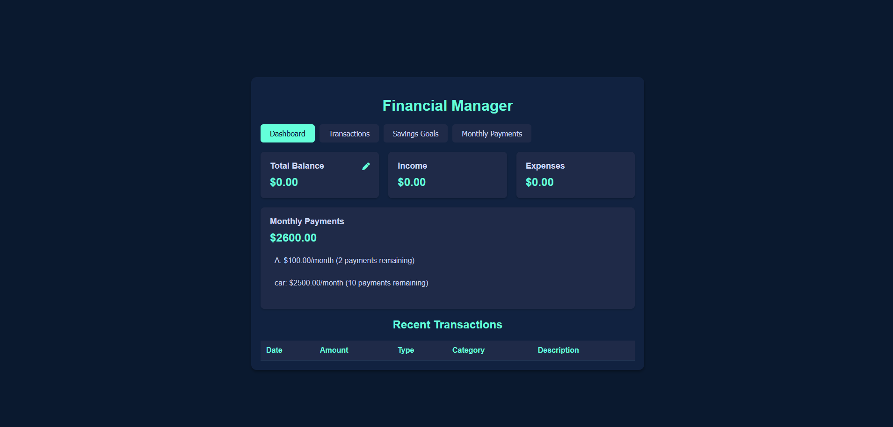

# Financial Manager

Financial Manager is a web-based application designed to help users manage their finances effectively. It allows users to track transactions, set savings goals, manage monthly payments, and view a dashboard with financial insights.

---

## Features

- **Dashboard**: View an overview of your financial status, including total balance, income, expenses, and monthly payments.
- **Transactions**: Add, edit, and delete transactions. Categorize them as income or expenses.
- **Savings Goals**: Set and track savings goals with progress indicators.
- **Monthly Payments**: Manage recurring monthly payments, including total amount, monthly payment, and remaining payments.
- **Responsive Design**: Works seamlessly on both desktop and mobile devices.

---

## Technologies Used

- **Frontend**: HTML, CSS, JavaScript
- **Icons**: [Font Awesome](https://fontawesome.com/)
- **Local Storage**: Used to persist data in the browser.

---

## Getting Started

### Prerequisites

- A modern web browser (e.g., Chrome, Firefox, Edge).
- No additional software or dependencies are required.

## Installation

1. **Clone the repository**:
   git clone https://github.com/zDR34M/Financial-Manager.git
2. **Navigate to the project directory:**
    cd financial-manager

3. **Open the project:**
    Open the index.html file in your browser.

---

## Usage
    Dashboard:

        View your total balance, income, expenses, and monthly payments.

        Edit your total balance by clicking the edit icon.

    Transactions:

        Add new transactions by filling out the form.

        View all transactions in the table.

        Delete transactions using the delete button.

    Savings Goals:

        Set new savings goals by entering a goal name and target amount.

        Track your progress toward each goal.

        Delete goals using the delete button.

    Monthly Payments:

        Add new monthly payments by entering the payment name, total amount, monthly payment, and remaining payments.

        Edit or delete payments using the respective buttons.

---

## Folder Structure
 
    financial-manager/
    │
    ├── index.html          # Main HTML file
    ├── styles.css          # CSS styles for the application
    ├── script.js           # JavaScript logic for the application
    ├── README.md           # Project documentation
    └── screenshot.png      # Screenshot of the application (optional)

---

## Contributing

### Contributions are welcome! If you'd like to contribute to this project, please follow these steps:

    Fork the repository.

    Create a new branch for your feature or bugfix.

    Commit your changes.

    Push your branch to your fork.

    Submit a pull request.

---

## License

### This project is licensed under the MIT License. See the LICENSE file for details.
Acknowledgments

    Font Awesome for providing icons.

    Inspired by personal finance management tools like Mint and YNAB.

---

## Screenshots

---

## Contact

### If you have any questions or feedback, feel free to reach out:

    Name: Tareq

    Instagram: [@its.taaareq](https://www.instagram.com/its.taaareq/)

### Enjoy managing your finances with Financial Manager! 🚀
